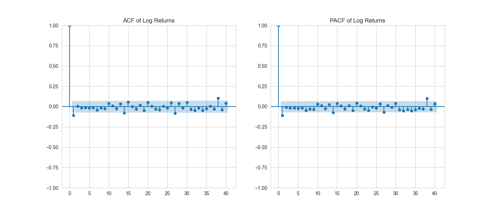
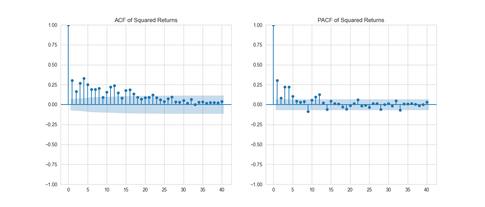

# Distribution summary — Log Returns & Returns

## Overview
This document summarizes how the dataset is distributed using basic descriptive statistics for both log returns and simple returns. Replace or extend the commentary below with plots, tests, and findings specific to your analysis.

## Key statistics
- Log returns
    - Mean: 0.00037935
    - Median: 0.00086735
    - Std. dev.: 0.00843959
    - Skewness: -0.43125
    - Kurtosis: 5.78923 (Excess kurtosis: 2.78923)
- Returns
    - Mean: 0.00041501
    - Median: 0.00086773
    - Std. dev.: 0.00842837
    - Skewness: -0.37336
    - Kurtosis: 5.71118 (Excess kurtosis: 2.71118)

## Quick interpretation
- Shape: Both series are moderately negatively skewed (skewness < 0), indicating a longer left tail and a tendency for larger negative moves than positive ones.
- Tails: Excess kurtosis ≈ 2.7–2.8 (kurtosis ≈ 5.7–5.8) ⇒ clearly leptokurtic / heavy-tailed relative to a normal distribution.
- Center and spread: Means are close to zero and below the medians, consistent with the negative skew. Standard deviations are small (~0.84%).
- Normality: Given the skewness and elevated kurtosis, the distributions deviate from normality.

## Q–Q Plot Analysis (Returns & Log Returns vs Normal Distribution)

### Overview  
The Q–Q plots for both **Returns** and **Log Returns** were compared against a theoretical normal distribution. Both series exhibit very similar behaviour, so the following observations and conclusions apply to **both**.

### Plots vs Normal Distribution

  
  

### Observations
- The **central points** (around the mean) lie close to the reference line → the **middle** of the distribution is approximately normal.
- The **tails deviate** from the line (points flare outward at both ends) → the data have **heavier tails** than a normal distribution (leptokurtic).
- The plots are **roughly symmetric** with a **mild left-leaning tendency**, consistent with the computed skewness (~**−0.43**).
- The excess kurtosis is high (≈ **2.7**), which corresponds to an actual kurtosis ≈ **5.7**, confirming **fat tails**.

### Interpretation
- The core behaviour of both series is close to normal, but the **tails are heavier** than Gaussian. This means **extreme returns (both gains and losses)** occur more often than a normal model would predict.
- The slight negative skewness indicates **downside extremes are a bit more pronounced** than upside extremes, but the asymmetry is not large.

### Implications
- Using a plain normal distribution **underestimates tail risk** (probability of extreme events).
- For modelling, risk measurement, or simulation, we need to consider distributions and models that capture heavy tails and conditional heteroskedasticity, for example:
  - Student’s **t-distribution** (fatter tails than normal)
  - **GARCH** (or GARCH-t) models to capture volatility clustering and fat tails
  - **Extreme Value Theory (EVT)** if interest is specifically in tail behavior
- For risk metrics (VaR, ES), prefer tail-aware methods (filtered historical simulation, GARCH-based VaR, EVT-based VaR) over simple Gaussian VaR.

### Plots vs t-distribution

  
  

### Observation
- The data points now lie much closer to the red reference line across both the center and tails compared to the normal Q-Q plot.
- This indicates that the t-distribution (df = 5) is a better fit for our log returns and returns than the normal distribution.

### Tail Behaviour
- Both extreme tails (far left and right) still show slight deviations, but they are significantly reduced relative to the normal Q–Q plot.
- The t-distribution successfully captures the heavy tails that our earlier analysis (high kurtosis) revealed.
- A t-distribution with df = 5 allows fatter tails than the normal distribution — exactly what our data needs.

<!-- **Suggested README snippet**
- Include the Q–Q plot image next to this text (e.g., `results/qq_plot_returns.png` and `results/qq_plot_log_returns.png`) so readers can visually confirm the tail deviation discussed above. -->

### Short takeaway
> Both Returns and Log Returns are near-normal in the center but show **significant fat tails** and **mild negative skewness**. Normal assumptions will understate extreme-event risk; use fat-tailed / volatility-aware models for more realistic inference and risk estimates.

## Volatility Clustering

Volatility clustering refers to the tendency of large changes in returns (positive or negative) to be followed by other large changes, and small changes to be followed by small changes. This behavior implies that **volatility is time-dependent**, even if returns themselves are not predictable.

### Plots
**ACF/PACF for Returns and Log Returns**

  
  

**ACF/PACF for Squared Returns and Log Returns**

  
  

### Evidence from ACF/PACF Analysis
- The **ACF/PACF of returns and log returns** show no significant autocorrelation → returns are approximately serially uncorrelated.
- However, the **ACF/PACF of squared (and absolute) returns** display **significant positive autocorrelation at low lags**, decaying slowly over time.
  - This pattern indicates that periods of high volatility tend to cluster together, confirming **volatility clustering**.
  - It suggests that while the mean process is random, the **variance process is autocorrelated** — a key property modeled by **ARCH/GARCH** type models.

### Interpretation
> The presence of significant autocorrelation in squared returns implies that the magnitude of returns is not random.  
> High-volatility periods follow high-volatility periods, and low-volatility periods follow low-volatility periods, a stylized fact of financial time series.

### Statistical Test Results — Interpretation & Analysis

Below are concise interpretations of the reported test statistics (ADF, ARCH-LM, and Ljung–Box) for **Price**, **Returns**, and **Log Returns**.

---

## Augmented Dickey–Fuller (ADF) test — stationarity
- **Price**
  - Test statistic = **−1.6003**, p-value = **0.4834**  
  **Interpretation:** Fail to reject the null of a unit root. The price series is **non-stationary**. This is expected for level price series and means you should **not** model prices directly in most time-series frameworks that assume stationarity.
- **Returns** and **Log Returns**
  - Test statistics = **≈ −30.69** and **−30.66**, p-values = **0.0**  
  **Interpretation:** Strongly reject the null of a unit root. Both returns and log-returns are **stationary**. This validates using returns (or log-returns) for modelling and inference (e.g., ARMA/GARCH) rather than raw prices.

**Practical consequence:** Use returns/log-returns (stationary) for further modeling (e.g., ARMA for mean, GARCH for variance). Differences between returns and log-returns are minor here since both are stationary.

---

## ARCH-LM test — conditional heteroskedasticity (volatility clustering)
- **Returns**
  - LM statistic = **151.71**, p-value ≈ **1.66e-27**
- **Log Returns**
  - LM statistic = **149.62**, p-value ≈ **4.47e-27**

**Interpretation:** The p-values are essentially zero, so we **strongly reject** the null hypothesis of no ARCH effects. There is **clear evidence of conditional heteroskedasticity** (i.e., volatility clustering) in both series.

**Practical consequence:** Variance is time-varying. You should model the conditional variance explicitly (e.g., ARCH, GARCH, or GARCH variants). Using homoskedastic error assumptions will lead to incorrect standard errors and poor risk forecasts.

---

## Ljung–Box test — autocorrelation (serial dependence)
- **Returns**
  - LB statistic = **56.94**, p-value = **0.0400** (lags = 40)
- **Log Returns**
  - LB statistic = **56.90**, p-value = **0.0404** (lags = 40)

**Interpretation:**  
The Ljung–Box test with **40 lags** examines whether there is significant autocorrelation in the series up to lag 40.  
With p-values slightly below 0.05, we **reject the null hypothesis** of no autocorrelation at the 5% level.  
This suggests there is **some weak but statistically significant serial dependence** across the first 40 lags of the returns and log-returns series.

However, given that daily financial returns often exhibit very low individual autocorrelations, this result likely reflects **small but persistent correlations** rather than strong predictable structure.  
It’s common for the Ljung–Box test to flag significance at large lags due to **volatility clustering** or minor dependencies rather than true linear predictability.

**Practical consequence:**
- There is **no strong short-term autocorrelation**, but some mild longer-lag dependence exists.
- You may still include **ARMA terms** if low-lag ACF/PACF plots show noticeable spikes, but the main time dependence likely comes from the **conditional variance (volatility)** rather than the mean.
- After fitting a GARCH-type model, you should re-run the Ljung–Box test on **standardized residuals** — they should become insignificant if the model successfully captures serial dependence in volatility.

---

### Overall synthesis & recommended next steps

1. **Use returns (or log-returns) not prices** — prices are nonstationary; returns/log-returns are stationary and appropriate for modeling.
2. **Model the conditional mean and variance separately:**
   - Fit an ARMA (or simple AR) model for the conditional mean if ACF/PACF indicate serial correlation.
   - Fit a GARCH-family model for the conditional variance to capture the significant ARCH effects (e.g., GARCH(1,1)). Consider GARCH-t (or Student-t residuals) because earlier diagnostics showed heavy tails.
3. **Diagnostic checks after fitting models:**
   - Examine standardized residuals and their ACF/PACF (should look like white noise).
   - Test squared standardized residuals for remaining ARCH effects (they should be insignificant if the GARCH model is adequate).
   - Check Q–Q plots of residuals vs chosen innovation distribution.
4. **Risk measurement:** For VaR/ES, prefer volatility-aware approaches (GARCH-based or EVT) over Gaussian historical VaR.
5. **Robust inference:** Until heteroskedasticity is modeled, avoid using homoskedastic standard errors; use robust (heteroskedasticity-consistent) standard errors if you need inference from simple regressions.

---

### Short summary (one-liner)
> Price series is non-stationary; **returns and log-returns are stationary**. Both return series exhibit **strong ARCH effects (volatility clustering)** and **mild but statistically significant serial correlation** (Ljung–Box), so model the mean with ARMA terms as needed and the variance with a GARCH-family model (consider Student-t innovations to accommodate heavy tails).

## Recommended diagnostics to include
- Visual
    - Histogram + KDE overlay
    - Q–Q plot vs. normal
    - Boxplot and zoom on tails
- Statistical tests
    - Jarque–Bera (for skewness/kurtosis)
    - Shapiro–Wilk or Anderson–Darling (if sample size appropriate)
- Time-series checks
    - ACF/PACF for returns and squared returns (volatility clustering)
    - Ljung–Box on residuals and squared residuals
    - ADF / KPSS for stationarity

## Modeling / practical implications
- Use heavy-tail / skewed error distributions (Student-t, skewed-t, GED) for likelihood-based models.
- For volatility modeling, consider GARCH-family models to capture clustering and conditional heteroskedasticity.
- Use robust estimators or bootstrap-based inference because normal-based standard errors may be unreliable.
- For risk measures, compute empirical and parametric VaR/ES using fat-tailed fits.

## Suggested next steps (checklist)
- [ ] Generate histogram + QQ plot and save to results/figures
- [ ] Run Jarque–Bera and report p-value
- [ ] Test for autocorrelation and conditional heteroskedasticity
- [ ] Fit candidate distributions (normal, t, skew-t) and compare AIC/BIC
- [ ] Document findings and modelling choices in this README

Notes: Replace the above template commentary with specific plot outputs, p-values, and model selection details as you run the diagnostics.