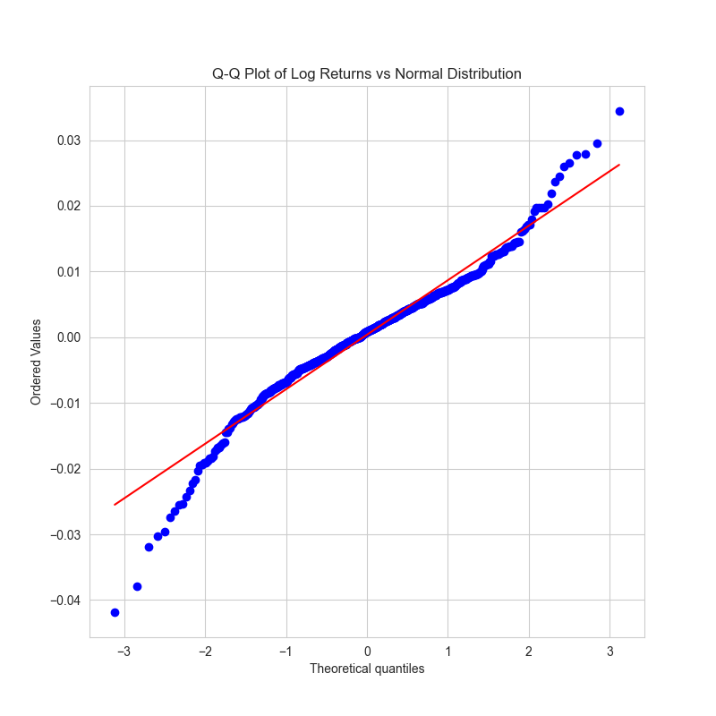
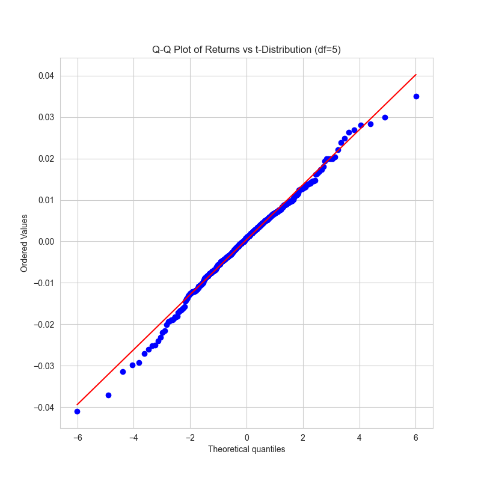
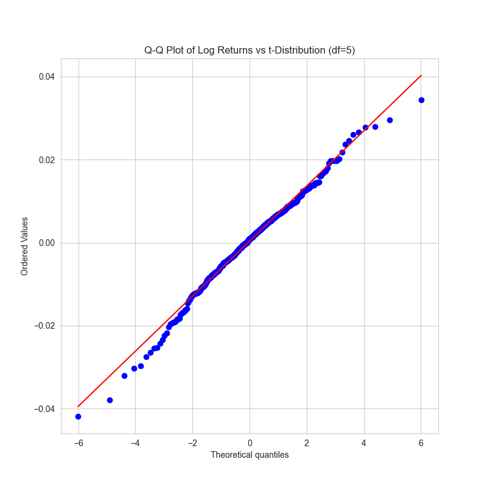

# Distribution summary — Log Returns & Returns

## Overview
This document summarizes how the dataset is distributed using basic descriptive statistics for both log returns and simple returns. Replace or extend the commentary below with plots, tests, and findings specific to your analysis.

## Key statistics
- Log returns
    - Mean: 0.00037935
    - Median: 0.00086735
    - Std. dev.: 0.00843959
    - Skewness: -0.43125
    - Kurtosis: 5.78923 (Excess kurtosis: 2.78923)
- Returns
    - Mean: 0.00041501
    - Median: 0.00086773
    - Std. dev.: 0.00842837
    - Skewness: -0.37336
    - Kurtosis: 5.71118 (Excess kurtosis: 2.71118)

## Quick interpretation
- Shape: Both series are moderately negatively skewed (skewness < 0), indicating a longer left tail and a tendency for larger negative moves than positive ones.
- Tails: Excess kurtosis ≈ 2.7–2.8 (kurtosis ≈ 5.7–5.8) ⇒ clearly leptokurtic / heavy-tailed relative to a normal distribution.
- Center and spread: Means are close to zero and below the medians, consistent with the negative skew. Standard deviations are small (~0.84%).
- Normality: Given the skewness and elevated kurtosis, the distributions deviate from normality.

## Q–Q Plot Analysis (Returns & Log Returns vs Normal Distribution)

**Overview**  
The Q–Q plots for both **Returns** and **Log Returns** were compared against a theoretical normal distribution. Both series exhibit very similar behaviour, so the following observations and conclusions apply to **both**.

**Plots**

  
  

**Observations**
- The **central points** (around the mean) lie close to the reference line → the **middle** of the distribution is approximately normal.
- The **tails deviate** from the line (points flare outward at both ends) → the data have **heavier tails** than a normal distribution (leptokurtic).
- The plots are **roughly symmetric** with a **mild left-leaning tendency**, consistent with the computed skewness (~**−0.43**).
- The excess kurtosis is high (≈ **2.7**), which corresponds to an actual kurtosis ≈ **5.7**, confirming **fat tails**.

**Interpretation**
- The core behaviour of both series is close to normal, but the **tails are heavier** than Gaussian. This means **extreme returns (both gains and losses)** occur more often than a normal model would predict.
- The slight negative skewness indicates **downside extremes are a bit more pronounced** than upside extremes, but the asymmetry is not large.

**Implications**
- Using a plain normal distribution **underestimates tail risk** (probability of extreme events).
- For modelling, risk measurement, or simulation, we need to consider distributions and models that capture heavy tails and conditional heteroskedasticity, for example:
  - Student’s **t-distribution** (fatter tails than normal)
  - **GARCH** (or GARCH-t) models to capture volatility clustering and fat tails
  - **Extreme Value Theory (EVT)** if interest is specifically in tail behavior
- For risk metrics (VaR, ES), prefer tail-aware methods (filtered historical simulation, GARCH-based VaR, EVT-based VaR) over simple Gaussian VaR.

**Plots vs t-distribution**

  
  

**Observation**
- The data points now lie much closer to the red reference line across both the center and tails compared to the normal Q-Q plot.
- This indicates that the t-distribution (df = 5) is a better fit for our log returns and returns than the normal distribution.

**Tail Behaviour**
- Both extreme tails (far left and right) still show slight deviations, but they are significantly reduced relative to the normal Q–Q plot.
- The t-distribution successfully captures the heavy tails that our earlier analysis (high kurtosis) revealed.
- A t-distribution with df = 5 allows fatter tails than the normal distribution — exactly what our data needs.

<!-- **Suggested README snippet**
- Include the Q–Q plot image next to this text (e.g., `results/qq_plot_returns.png` and `results/qq_plot_log_returns.png`) so readers can visually confirm the tail deviation discussed above. -->

**Short takeaway**
> Both Returns and Log Returns are near-normal in the center but show **significant fat tails** and **mild negative skewness**. Normal assumptions will understate extreme-event risk; use fat-tailed / volatility-aware models for more realistic inference and risk estimates.

## Recommended diagnostics to include
- Visual
    - Histogram + KDE overlay
    - Q–Q plot vs. normal
    - Boxplot and zoom on tails
- Statistical tests
    - Jarque–Bera (for skewness/kurtosis)
    - Shapiro–Wilk or Anderson–Darling (if sample size appropriate)
- Time-series checks
    - ACF/PACF for returns and squared returns (volatility clustering)
    - Ljung–Box on residuals and squared residuals
    - ADF / KPSS for stationarity

## Modeling / practical implications
- Use heavy-tail / skewed error distributions (Student-t, skewed-t, GED) for likelihood-based models.
- For volatility modeling, consider GARCH-family models to capture clustering and conditional heteroskedasticity.
- Use robust estimators or bootstrap-based inference because normal-based standard errors may be unreliable.
- For risk measures, compute empirical and parametric VaR/ES using fat-tailed fits.

## Suggested next steps (checklist)
- [ ] Generate histogram + QQ plot and save to results/figures
- [ ] Run Jarque–Bera and report p-value
- [ ] Test for autocorrelation and conditional heteroskedasticity
- [ ] Fit candidate distributions (normal, t, skew-t) and compare AIC/BIC
- [ ] Document findings and modelling choices in this README

Notes: Replace the above template commentary with specific plot outputs, p-values, and model selection details as you run the diagnostics.